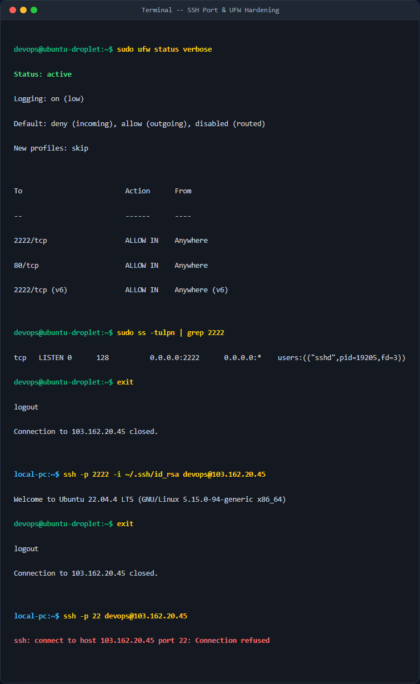

# Bài 2: Quản trị Tường lửa UFW cho Cụm Dịch vụ Multi-port

## Giới thiệu
Hướng dẫn và công cụ cấu hình tường lửa UFW để bảo mật máy chủ chạy đa dịch vụ (SSH, Web, Spring Boot) đồng thời cô lập cổng cơ sở dữ liệu MySQL (3306) khỏi môi trường Internet.

## Chức năng đã thực hiện
- Cấu hình chặn mặc định toàn bộ lưu lượng đi vào hệ thống (`deny incoming`).
- Cho phép toàn bộ lưu lượng đi ra (`allow outgoing`).
- Mở cổng `22/tcp` cho SSH.
- Mở cổng `80/tcp` cho dịch vụ HTTP (Nginx).
- Mở cổng `8082/tcp` cho ứng dụng Spring Boot.
- Giữ cổng `3306` (MySQL) bị chặn hoàn toàn từ Internet bằng cách không thiết lập luật cho phép.

## Hướng dẫn chạy chương trình

1. Cấp quyền thực thi cho tệp script:
   ```bash
   chmod +x setup_ufw.sh
   ```

2. Chạy script dưới quyền quản trị (`sudo`):
   ```bash
   sudo ./setup_ufw.sh
   ```

## Kết quả đầu ra mong đợi của lệnh `sudo ufw status verbose`

```text
Status: active
Logging: on (low)
Default: deny (incoming), allow (outgoing), disabled (routed)
New profiles: skip

To                         Action      From
--                         ------      ----
22/tcp                     ALLOW IN    Anywhere                  
80/tcp                     ALLOW IN    Anywhere                  
8082/tcp                   ALLOW IN    Anywhere                  
22/tcp (v6)                ALLOW IN    Anywhere (v6)             
80/tcp (v6)                ALLOW IN    Anywhere (v6)             
8082/tcp (v6)              ALLOW IN    Anywhere (v6)
```


## Ảnh chụp màn hình kết quả thực nghiệm

